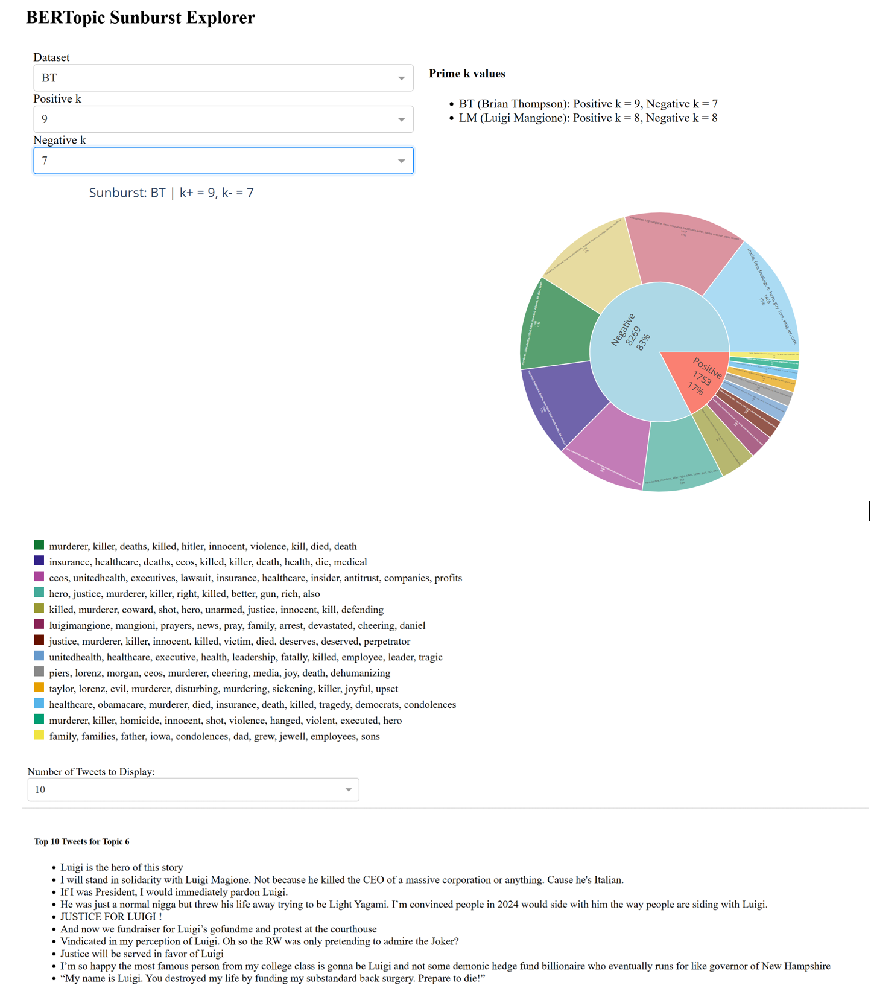

# BERTopic Sunburst Explorer

An interactive Dash app for exploring sentiment-based BERTopic models. Users can explore Positive and Negative topic clusters, click to reveal representative tweets, and compare topic proportions using a dynamic sunburst chart.

🔗 **Live App**:  
👉 [https://dash-sunburst-production.up.railway.app](https://dash-sunburst-production.up.railway.app)

---

## 🌟 Features

- Switch between datasets (e.g., Brian Thompson, Luigi Mangione)
- Choose topic count (`k`) for both Positive and Negative sentiment models
- Click on any topic segment to preview representative tweets
- Color-coded legend for visual topic tracking
- Hosted via [Railway](https://railway.app) for 1-click access

---

## 📸 Screenshot

> **Interactive Topic Breakdown with Tweets**



---

## 🚀 Local Setup

```bash
git clone https://github.com/YOUR_USERNAME/bertopic-sunburst.git
cd bertopic-sunburst
pip install -r requirements.txt
python app.py
