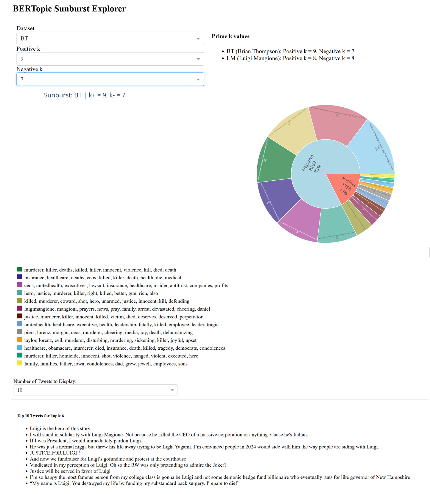

# 🌞 BERTopic Sunburst Explorer

An interactive web app built with Dash and Plotly to explore topic clusters generated by [BERTopic](https://maartengr.github.io/BERTopic/).  
Created by **Chris Reddish**, this visualization breaks down sentiment-driven topics into a **sunburst chart** where you can click to view real tweet examples per topic.

🌐 **Live App**:  
👉 (https://dash-sunburst-production.up.railway.app)](https://dash-sunburst.onrender.com)

---

## 🚀 Features

- 📊 **Sunburst chart** showing topic breakdown by sentiment and frequency  
- 🧠 Clickable segments to explore representative tweets for each topic  
- 🎯 Supports multiple datasets (`BT`, `LM`) and custom topic numbers (`k`)  
- 🧱 Topic label generation using BERTopic’s top keywords  
- 🎨 Custom color palette and dynamic legend  
- 🪄 Responsive interface hosted on [Railway](https://railway.app)

---

## 📸 Screenshot

> **Sentiment-driven Topic Breakdown**



---

## 📁 File Structure

```
project/
├── app.py                          # Main Dash app
├── data/                           # Folder for CSVs
│   ├── *_document_info.csv         # File with original_text and topic assignments
│   └── *_topic_representation.csv  # File with BERTopic keywords per topic
├── screenshots/                    # Screenshot image for README
├── requirements.txt                # Dependency list
├── runtime.txt                     # Python version
├── Procfile                        # For Railway deployment
├── .gitignore                      # Files to exclude from git
├── LICENSE                         # MIT License
└── README.md                       # This file
```

---

## 📦 Requirements

Install required libraries with:

```bash
pip install -r requirements.txt
```

Key packages:
- `dash`
- `plotly`
- `pandas`

Used during preprocessing:
- `bertopic`
- `ast`
- `scikit-learn`, `umap-learn`, `hdbscan`, `nltk`, `sentence-transformers` (if re-generating models)

---

## ⚙️ How to Run Locally

1. Place your pre-generated BERTopic files in the `data/` folder.
2. Each dataset must include:
   - `<sentiment>_<model>_k=<X>mini_document_info.csv`
   - `<sentiment>_<model>_k=<X>mini_topic_representation.csv`
3. Then run:

```bash
python app.py
```

4. Open in browser:
```
http://localhost:10000
```

---

## 📊 Data Format Example

Each model requires:
- One `*_document_info.csv` (with at least `original_text`, `Topic`)
- One `*_topic_representation.csv` (with `Topic`, `Representation`)

**Example File Names:**
```
positive_BT_k=9mini_document_info.csv
positive_BT_k=9mini_topic_representation.csv
```

**Required Columns:**
| File                      | Required Columns              |
|---------------------------|-------------------------------|
| *_document_info.csv       | `original_text`, `Topic`      |
| *_topic_representation.csv| `Topic`, `Representation`     |

---

## 🛠️ App Functionality

- When launched, the app shows **sunburst segments** for Positive and Negative topics based on selected `k`.
- Clicking a segment highlights top representative tweets from the original dataset.
- Color-coded segments make visual scanning of themes easier.
- Tweet previews pull from `original_text`, `Document`, or `content` fields.

---

## 🛡️ License

MIT License © 2025 [Chris Reddish](https://www.linkedin.com/in/christopher-reddish-192a402a5)

---

## 💬 Contact

Have questions, want to improve the app, or interested in data science collaboration?

📩 Reach out on [LinkedIn → Chris Reddish](https://www.linkedin.com/in/christopher-reddish-192a402a5)

